# Konelsis Kurumsal Platform — Veri tabanı ER diyagramları

**Durum:** DB-G8 onaylandı (4 Eylül 2026); 5 Eylül 2026 kullanıcı revizyonu (D-15R, D-42…D-46) bu belgeye işlendi. Diyagramlar `personnel` birleşik kaydını ve sistem hesaplarını gösterir; DDL üretimi bu belgeden yapılmaz.  
**Sürüm:** 0.8 / 5 Eylül 2026  
**Kaynak model:** [Veri tabanı tasarım planı](03-veri-tabani-tasarim-plani.md)  
**Hedef veritabanı:** MySQL 8.4 LTS / InnoDB / `utf8mb4`

## 1. Kapsam ve gösterim kuralları

Platform tek bir okunaksız diyagram yerine, aynı FK sözlüğüne bağlı alan diyagramlarına ayrılmıştır. `ERD-00` aggregate/bağlam haritasıdır; diğer diyagramlar planlanan ilişkisel tabloları gösterir.

- Teknik kimlikler varsayılan olarak AUTO_INCREMENT `BIGINT UNSIGNED`'dır. İstisnalar diyagramda belirtilir.
- `PK`, `FK` ve `UK` sırasıyla primary key, foreign key ve unique key adayını gösterir.
- `||` tam bir, `o|` sıfır veya bir, `|{` en az bir, `o{` sıfır veya çok cardinality'sidir.
- Mermaid ER gösterimi composite FK, generated guard, `CHECK`, XOR hedef ve tarih aralığı overlap kuralını tam ifade edemez; bunlar Bölüm 15'te ayrıca bağlayıcıdır.
- `document_links` ve `personnel_activities` gibi kontrollü genel referansların her hedefi çizilmez; izinli hedef türü/veri sınıfı registry ile sınırlandırılır.
- `_rm` read-model/projection tabloları doğruluk kaynağı değildir ve kaynak ER zincirini sade tutmak için diyagramlara alınmaz.
- Diyagramlarda görünmeyen standart audit alanları (`created_at`, actor/correlation, gerekliyse `row_version`) veri sözlüğünde ayrıca tanımlanacaktır.

## 2. ERD-00 — Üst seviye aggregate haritası

Bu görünüm domain bağımlılığını anlatır; her çizgi doğrudan fiziksel FK anlamına gelmez.

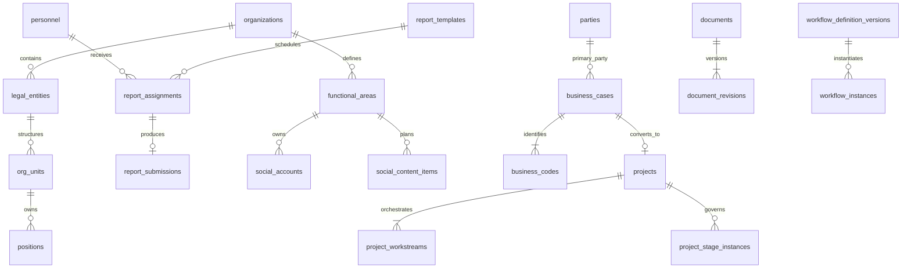

## 3. ERD-01 — Organizasyon, kimlik ve personel çekirdeği

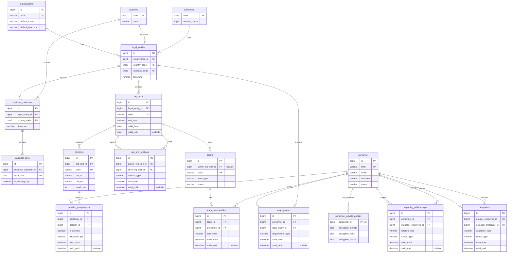

## 4. ERD-02 — Functional Area, yetkinlik ve İK uzantıları

### 4.1 Functional Area yönetişimi

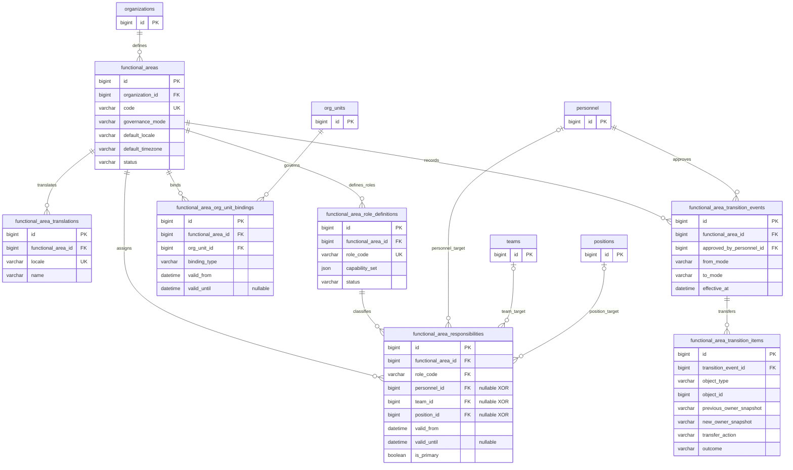

`functional_area_responsibilities` hedeflerinden tam biri dolu olmalıdır. `function_owner` için tek aktif primary kayıt ve bütün tarih aralığı overlap kuralları generated guard + application-service lock deseniyle korunur.

### 4.2 Yetkinlik, eğitim ve İK operasyonu

```mermaid
erDiagram
    personnel {
        bigint id PK
    }
    competencies {
        bigint id PK
        varchar code UK
    }
    personnel_competencies {
        bigint id PK
        bigint personnel_id FK
        bigint competency_id FK
        varchar level
        bigint verified_by_personnel_id FK "nullable"
    }
    certifications {
        bigint id PK
        varchar code UK
    }
    personnel_certifications {
        bigint id PK
        bigint personnel_id FK
        bigint certification_id FK
        bigint document_revision_id FK "nullable"
        date valid_until "nullable"
    }
    trainings {
        bigint id PK
        varchar code UK
    }
    training_attendances {
        bigint id PK
        bigint training_id FK
        bigint personnel_id FK
        varchar outcome
    }
    leave_types {
        bigint id PK
        varchar code UK
    }
    leave_requests {
        bigint id PK
        bigint personnel_id FK
        bigint leave_type_id FK
        date starts_on
        date ends_on
        varchar status
    }
    leave_approvals {
        bigint id PK
        bigint leave_request_id FK
        bigint approver_personnel_id FK
        varchar decision
    }
    timesheets {
        bigint id PK
        bigint personnel_id FK
        date period_start
        date period_end
        varchar status
    }
    timesheet_lines {
        bigint id PK
        bigint timesheet_id FK
        bigint project_id FK "nullable"
        decimal hours
    }
    expense_claims {
        bigint id PK
        bigint personnel_id FK
        varchar currency_code FK
        varchar status
    }
    expense_lines {
        bigint id PK
        bigint expense_claim_id FK
        decimal amount
    }
    expense_approvals {
        bigint id PK
        bigint expense_claim_id FK
        bigint approver_personnel_id FK
        varchar decision
    }
    workforce_requests {
        bigint id PK
        bigint requesting_org_unit_id FK
        varchar status
    }
    staffing_options {
        bigint id PK
        bigint workforce_request_id FK
        bigint personnel_id FK "nullable"
        varchar option_type
    }
    job_requisitions {
        bigint id PK
        bigint workforce_request_id FK
        varchar status
    }
    job_post_versions {
        bigint id PK
        bigint job_requisition_id FK
        int version_no UK
    }
    candidates {
        bigint id PK
        varchar status
    }
    applications {
        bigint id PK
        bigint candidate_id FK
        bigint job_requisition_id FK
        varchar status
    }
    interviews {
        bigint id PK
        bigint application_id FK
        datetime scheduled_at
    }
    performance_cycles {
        bigint id PK
        varchar code UK
    }
    performance_records {
        bigint id PK
        bigint performance_cycle_id FK
        bigint personnel_id FK
        varchar status
    }
    development_actions {
        bigint id PK
        bigint performance_record_id FK
        datetime due_at
    }

    personnel ||--o{ personnel_competencies : has
    competencies ||--o{ personnel_competencies : classifies
    personnel ||--o{ personnel_certifications : holds
    certifications ||--o{ personnel_certifications : classifies
    personnel ||--o{ training_attendances : attends
    trainings ||--o{ training_attendances : records
    personnel ||--o{ leave_requests : requests
    leave_types ||--o{ leave_requests : classifies
    leave_requests ||--o{ leave_approvals : reviewed_by
    personnel ||--o{ timesheets : submits
    timesheets ||--|{ timesheet_lines : contains
    personnel ||--o{ expense_claims : submits
    expense_claims ||--|{ expense_lines : contains
    expense_claims ||--o{ expense_approvals : reviewed_by
    workforce_requests ||--o{ staffing_options : evaluates
    personnel o|--o{ staffing_options : candidate_employee
    workforce_requests ||--o| job_requisitions : may_open
    job_requisitions ||--|{ job_post_versions : versions
    candidates ||--o{ applications : submits
    job_requisitions ||--o{ applications : receives
    applications ||--o{ interviews : schedules
    performance_cycles ||--o{ performance_records : contains
    personnel ||--o{ performance_records : evaluated_in
    performance_records ||--o{ development_actions : produces
```

## 5. ERD-03 — Şablonlu kurumsal raporlama

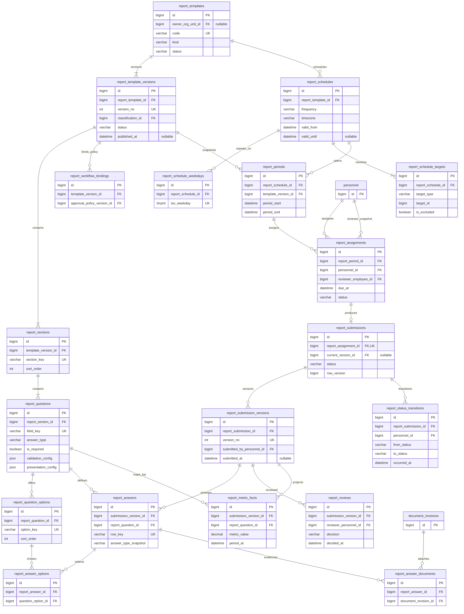

## 6. ERD-04 — Bildirim, kritik iş ve görevler

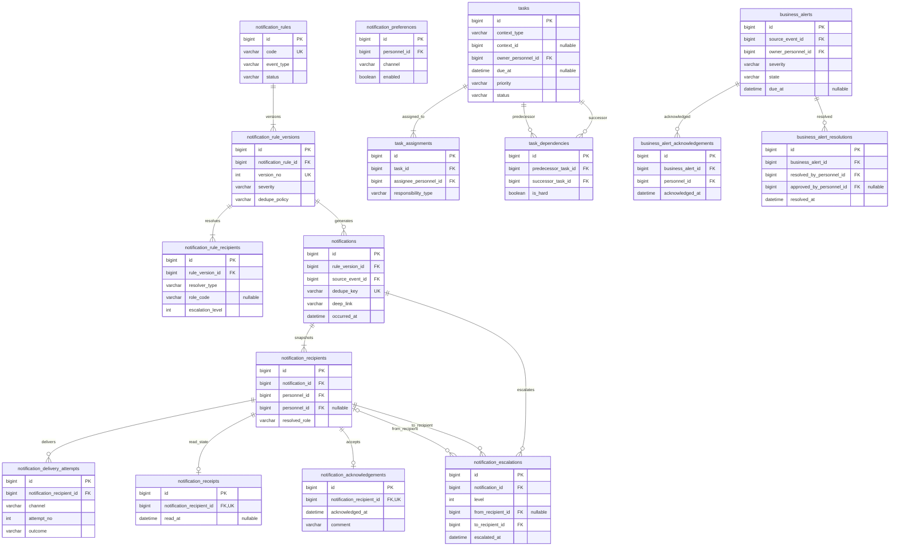

## 7. ERD-05 — DMS, konuşma ve e-posta

### 7.1 Doküman ve dosya zinciri

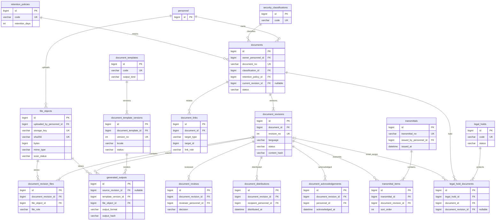

### 7.2 Kayıtlı konuşma ve e-posta alımı

```mermaid
erDiagram
    security_classifications {
        bigint id PK
        varchar code UK
    }
    conversations {
        bigint id PK
        varchar conversation_type
        varchar scope_type
        bigint scope_id "nullable"
        bigint classification_id FK
        varchar history_policy
    }
    conversation_memberships {
        bigint id PK
        bigint conversation_id FK
        bigint personnel_id FK
        varchar role
        datetime joined_at
        datetime left_at "nullable"
    }
    messages {
        bigint id PK
        bigint conversation_id FK
        bigint conversation_sequence UK
        bigint author_personnel_id FK
        bigint reply_to_message_id FK "nullable"
        varchar status
    }
    message_versions {
        bigint id PK
        bigint message_id FK
        int version_no UK
        json content_snapshot
    }
    message_mentions {
        bigint id PK
        bigint message_id FK
        bigint mentioned_personnel_id FK
    }
    message_attachments {
        bigint id PK
        bigint message_id FK
        bigint file_object_id FK "nullable XOR"
        bigint document_revision_id FK "nullable XOR"
    }
    conversation_read_cursors {
        bigint id PK
        bigint conversation_id FK
        bigint personnel_id FK
        bigint last_read_sequence
    }
    message_business_links {
        bigint id PK
        bigint message_id FK
        varchar target_type
        bigint target_id
    }
    mailboxes {
        bigint id PK
        varchar code UK
        varchar status
    }
    inbound_email_messages {
        bigint id PK
        bigint mailbox_id FK
        varchar internet_message_id
        varchar content_hash
        varchar status
    }
    inbound_email_recipients {
        bigint id PK
        bigint inbound_email_message_id FK
        varchar recipient_type
        varchar address
    }
    inbound_email_attachments {
        bigint id PK
        bigint inbound_email_message_id FK
        bigint file_object_id FK
    }
    inbound_email_business_links {
        bigint id PK
        bigint inbound_email_message_id FK
        varchar target_type
        bigint target_id
    }
    email_processing_attempts {
        bigint id PK
        bigint inbound_email_message_id FK
        int attempt_no
        varchar outcome
    }
    personnel {
        bigint id PK
    }
    file_objects {
        bigint id PK
    }
    document_revisions {
        bigint id PK
    }

    security_classifications ||--o{ conversations : classifies
    conversations ||--|{ conversation_memberships : has
    personnel ||--o{ conversation_memberships : joins
    conversations ||--o{ messages : contains
    personnel ||--o{ messages : authors
    messages o|--o{ messages : replies
    messages ||--|{ message_versions : versions
    messages ||--o{ message_mentions : mentions
    personnel ||--o{ message_mentions : mentioned
    messages ||--o{ message_attachments : attaches
    file_objects o|--o{ message_attachments : raw_file
    document_revisions o|--o{ message_attachments : controlled_file
    conversations ||--o{ conversation_read_cursors : read_by
    personnel ||--o{ conversation_read_cursors : tracks
    messages ||--o{ message_business_links : relates
    mailboxes ||--o{ inbound_email_messages : receives
    inbound_email_messages ||--|{ inbound_email_recipients : addresses
    inbound_email_messages ||--o{ inbound_email_attachments : contains
    file_objects ||--o{ inbound_email_attachments : stores
    inbound_email_messages ||--o{ inbound_email_business_links : relates
    inbound_email_messages ||--o{ email_processing_attempts : processes
```

## 8. ERD-06 — Sosyal Medya

### 8.1 Hesap ve entegrasyon bağlantısı

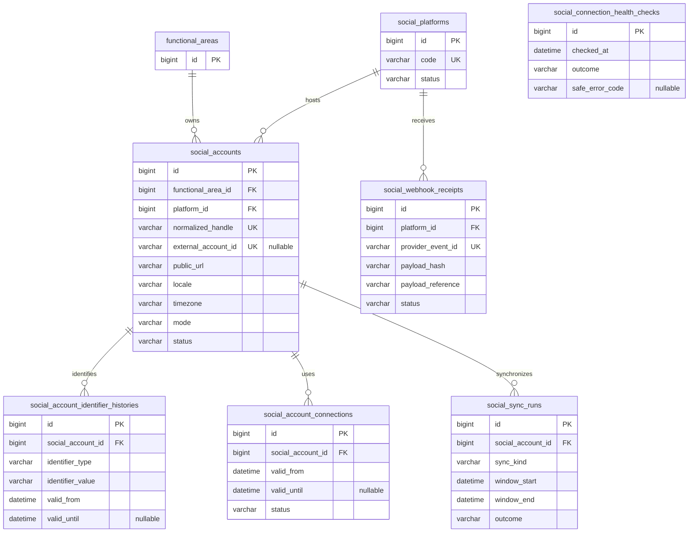

### 8.2 İçerik, özel gün ve yayın

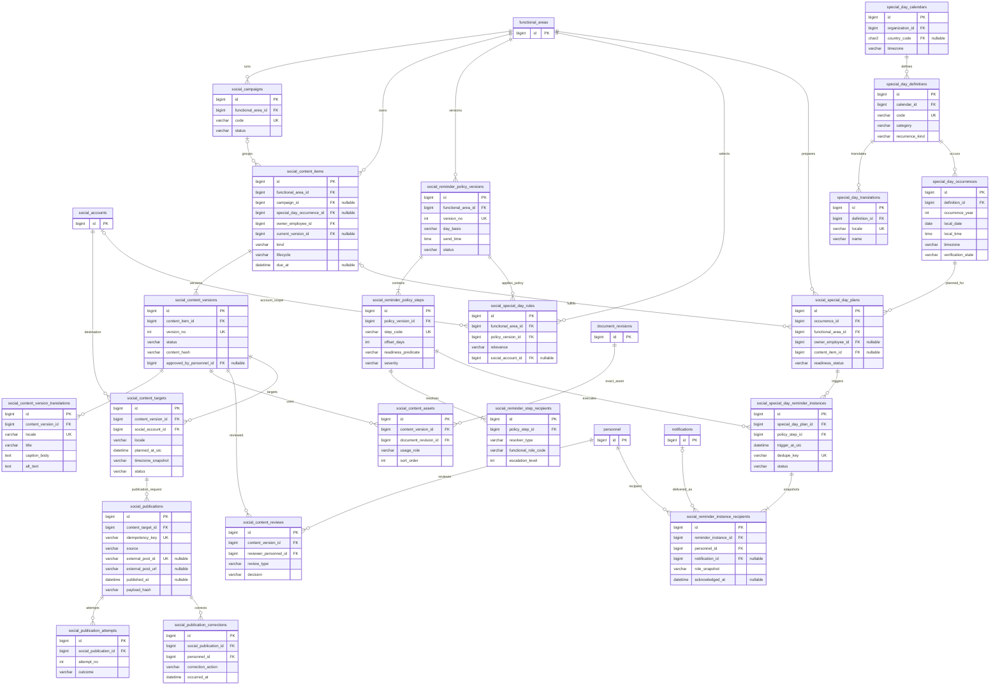

### 8.3 Metrik ve KPI

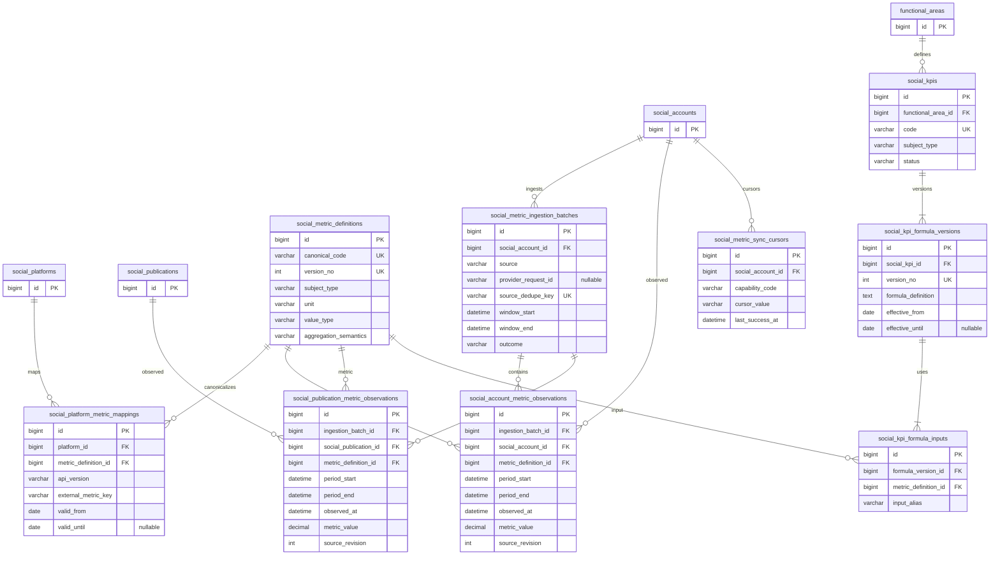

## 9. ERD-07 — Party, İş Alım, teklif, sözleşme ve Operasyona devir

### 9.1 Party, business case, ihale ve kod soy zinciri

~~~mermaid
erDiagram
    parties {
        bigint id PK
        varchar party_kind
        varchar display_name
        varchar status
    }
    party_roles {
        bigint id PK
        bigint party_id FK
        varchar role_code
        datetime valid_from
        datetime valid_until "nullable"
    }
    organization_profiles {
        bigint party_id PK, FK
        varchar legal_name
        varchar registration_no
    }
    person_profiles {
        bigint party_id PK, FK
        varchar given_name
        varchar family_name
    }
    addresses {
        bigint id PK
        bigint party_id FK
        varchar address_type
        char2 country_code FK
    }
    communication_points {
        bigint id PK
        bigint party_id FK
        varchar channel_type
        varchar normalized_value
    }
    contact_relationships {
        bigint id PK
        bigint organization_party_id FK
        bigint contact_party_id FK
        varchar relationship_role
        datetime valid_from
        datetime valid_until "nullable"
    }
    party_licenses {
        bigint id PK
        bigint party_id FK
        varchar license_type
        varchar license_no
        date valid_until "nullable"
    }
    party_certificates {
        bigint id PK
        bigint party_id FK
        varchar certificate_type
        varchar certificate_no
        date valid_until "nullable"
    }
    party_annual_reviews {
        bigint id PK
        bigint party_id FK
        int review_year
        varchar outcome
    }
    business_number_allocations {
        bigint sequence_no PK
        varchar purpose
        varchar status
        datetime allocated_at
    }
    business_cases {
        bigint id PK
        bigint sequence_no FK, UK
        bigint legal_entity_id FK
        bigint primary_party_id FK
        varchar lifecycle_segment
        varchar outcome "nullable"
    }
    business_codes {
        bigint id PK
        bigint business_case_id FK
        bigint sequence_no FK
        varchar code_kind
        varchar formatted_code UK
        bigint predecessor_code_id FK "nullable"
    }
    opportunities {
        bigint id PK
        bigint business_case_id FK, UK
        varchar stage
        decimal probability_pct
    }
    opportunity_stage_histories {
        bigint id PK
        bigint opportunity_id FK
        varchar from_stage
        varchar to_stage
        datetime changed_at
    }
    business_development_activities {
        bigint id PK
        bigint business_case_id FK
        varchar activity_type
        datetime occurred_at
    }
    tender_sources {
        bigint id PK
        varchar code UK
        varchar source_type
    }
    tender_notices {
        bigint id PK
        bigint business_case_id FK
        bigint tender_source_id FK
        varchar external_notice_id
        varchar status
    }
    tender_notice_versions {
        bigint id PK
        bigint tender_notice_id FK
        int version_no UK
        varchar source_hash
    }
    tender_requirements {
        bigint id PK
        bigint tender_notice_version_id FK
        varchar requirement_type
        boolean is_mandatory
    }
    tender_deadlines {
        bigint id PK
        bigint tender_notice_version_id FK
        varchar deadline_type
        datetime due_at_utc
    }

    parties ||--o{ party_roles : has
    parties ||--o| organization_profiles : organization_subtype
    parties ||--o| person_profiles : person_subtype
    parties ||--o{ addresses : addressed
    parties ||--o{ communication_points : contacted
    parties ||--o{ contact_relationships : organization_contact
    parties ||--o{ contact_relationships : contact_person
    parties ||--o{ party_licenses : licensed
    parties ||--o{ party_certificates : certified
    parties ||--o{ party_annual_reviews : reviewed
    business_number_allocations ||--o| business_cases : reserves
    parties ||--o{ business_cases : primary_party
    business_cases ||--|{ business_codes : identifies
    business_codes o|--o| business_codes : predecessor
    business_cases ||--o| opportunities : qualifies
    opportunities ||--o{ opportunity_stage_histories : changes
    business_cases ||--o{ business_development_activities : records
    tender_sources ||--o{ tender_notices : publishes
    business_cases ||--o{ tender_notices : tracks
    tender_notices ||--|{ tender_notice_versions : versions
    tender_notice_versions ||--o{ tender_requirements : specifies
    tender_notice_versions ||--o{ tender_deadlines : schedules
~~~

### 9.2 Teklif, sözleşme ve immutable handoff

~~~mermaid
erDiagram
    business_cases {
        bigint id PK
    }
    proposals {
        bigint id PK
        bigint business_case_id FK
        varchar status
        bigint current_version_id FK "nullable"
    }
    proposal_versions {
        bigint id PK
        bigint proposal_id FK
        int version_no UK
        varchar locale
        varchar status
        varchar version_hash
    }
    proposal_documents {
        bigint id PK
        bigint proposal_version_id FK
        bigint document_revision_id FK
        varchar document_role
    }
    compliance_items {
        bigint id PK
        bigint proposal_version_id FK
        varchar requirement_code
        varchar compliance_state
    }
    deviations {
        bigint id PK
        bigint proposal_version_id FK
        bigint compliance_item_id FK "nullable"
        varchar deviation_type
        varchar status
    }
    brand_items {
        bigint id PK
        bigint proposal_version_id FK
        varchar item_code
        varchar proposed_brand
        varchar approval_state
    }
    responsibility_matrix_items {
        bigint id PK
        bigint proposal_version_id FK
        varchar scope_code
        varchar responsible_party_role
    }
    estimate_versions {
        bigint id PK
        bigint proposal_version_id FK
        int version_no UK
        char3 currency_code FK
        varchar status
    }
    estimate_lines {
        bigint id PK
        bigint estimate_version_id FK
        bigint parent_line_id FK "nullable"
        varchar cost_type
        decimal quantity
        decimal unit_price
    }
    pricing_scenarios {
        bigint id PK
        bigint estimate_version_id FK
        varchar scenario_code
        decimal target_margin_pct
    }
    boq_items {
        bigint id PK
        bigint estimate_version_id FK
        varchar item_code
        decimal quantity
    }
    contracts {
        bigint id PK
        bigint business_case_id FK
        varchar contract_no UK
        varchar contract_type
        varchar status
        bigint current_version_id FK "nullable"
    }
    contract_versions {
        bigint id PK
        bigint contract_id FK
        int version_no UK
        varchar locale
        char3 currency_code FK
        decimal contract_value
        varchar version_hash
        varchar status
    }
    contract_parties {
        bigint id PK
        bigint contract_version_id FK
        bigint party_id FK
        varchar contract_role
    }
    contract_documents {
        bigint id PK
        bigint contract_version_id FK
        bigint document_revision_id FK
        varchar document_role
    }
    contract_obligations {
        bigint id PK
        bigint contract_version_id FK
        varchar obligation_type
        bigint responsible_party_id FK "nullable"
        date due_on "nullable"
    }
    contract_milestones {
        bigint id PK
        bigint contract_version_id FK
        varchar milestone_code
        date planned_on
        decimal payment_pct "nullable"
    }
    operation_handoffs {
        bigint id PK
        bigint business_case_id FK, UK
        varchar status
        bigint accepted_version_id FK "nullable"
    }
    operation_handoff_versions {
        bigint id PK
        bigint operation_handoff_id FK
        bigint proposal_version_id FK
        bigint contract_version_id FK "nullable"
        int version_no UK
        varchar snapshot_hash
        varchar status
    }
    handoff_items {
        bigint id PK
        bigint handoff_version_id FK
        bigint document_revision_id FK "nullable"
        varchar item_type
        varchar completion_state
    }
    handoff_reviews {
        bigint id PK
        bigint handoff_version_id FK
        bigint reviewer_personnel_id FK
        varchar decision
        datetime decided_at
    }
    parties {
        bigint id PK
    }
    document_revisions {
        bigint id PK
    }
    personnel {
        bigint id PK
    }

    business_cases ||--o{ proposals : prepares
    proposals ||--|{ proposal_versions : versions
    proposal_versions ||--o{ proposal_documents : includes
    document_revisions ||--o{ proposal_documents : exact_revision
    proposal_versions ||--o{ compliance_items : compliance
    proposal_versions ||--o{ deviations : deviates
    compliance_items o|--o{ deviations : source_item
    proposal_versions ||--o{ brand_items : brands
    proposal_versions ||--o{ responsibility_matrix_items : responsibilities
    proposal_versions ||--o{ estimate_versions : estimates
    estimate_versions ||--|{ estimate_lines : contains
    estimate_lines o|--o{ estimate_lines : parent
    estimate_versions ||--o{ pricing_scenarios : models
    estimate_versions ||--o{ boq_items : contains
    business_cases ||--o{ contracts : contracts
    contracts ||--|{ contract_versions : versions
    contract_versions ||--|{ contract_parties : binds
    parties ||--o{ contract_parties : participates
    contract_versions ||--o{ contract_documents : evidenced
    document_revisions ||--o{ contract_documents : exact_revision
    contract_versions ||--o{ contract_obligations : obligates
    parties o|--o{ contract_obligations : responsible
    contract_versions ||--o{ contract_milestones : schedules
    business_cases ||--o| operation_handoffs : transfers
    operation_handoffs ||--|{ operation_handoff_versions : versions
    proposal_versions ||--o{ operation_handoff_versions : exact_proposal
    contract_versions o|--o{ operation_handoff_versions : exact_contract
    operation_handoff_versions ||--|{ handoff_items : contains
    document_revisions o|--o{ handoff_items : evidence
    operation_handoff_versions ||--o{ handoff_reviews : reviewed
    personnel ||--o{ handoff_reviews : reviewer
~~~

Bu modelde teklif, sözleşme ve Operasyona devir kayıtları kök kimliğe değil onaylanan kesin sürüme bağlanır. Bir business case için bir teklif kökü varsayımı DB-G4'te doğrulanacaktır; alternatif teklifler gerekiyorsa business case–proposal cardinality'si 1:N kalır ve seçili teklif ayrı generated guard ile korunur.

## 10. ERD-08 — Proje, workstream, stage-gate ve departman devri

### 10.1 Proje kökü ve operasyon workstream'leri

~~~mermaid
erDiagram
    business_cases {
        bigint id PK
    }
    business_codes {
        bigint id PK
        bigint business_case_id FK
        varchar code_kind
        varchar formatted_code UK
    }
    operation_handoff_versions {
        bigint id PK
    }
    parties {
        bigint id PK
    }
    legal_entities {
        bigint id PK
    }
    personnel {
        bigint id PK
    }
    file_objects {
        bigint id PK
    }
    projects {
        bigint id PK
        bigint business_case_id FK, UK
        bigint project_business_code_id FK, UK
        bigint accepted_handoff_version_id FK, UK
        bigint customer_party_id FK
        bigint legal_entity_id FK
        bigint project_manager_employee_id FK
        bigint cover_file_object_id FK "nullable"
        bigint primary_focus_workstream_id FK "nullable"
        varchar status
    }
    component_definitions {
        bigint id PK
        varchar code UK
        varchar status
    }
    project_components {
        bigint id PK
        bigint project_id FK
        bigint component_definition_id FK
        varchar scope_state
    }
    operation_group_definitions {
        bigint id PK
        varchar code UK
        varchar name_tr
        varchar name_en
    }
    project_workstreams {
        bigint id PK
        bigint project_id FK
        bigint group_definition_id FK
        bigint owner_personnel_id FK
        varchar status
        decimal progress_pct
    }
    workstream_dependencies {
        bigint id PK
        bigint predecessor_workstream_id FK
        bigint successor_workstream_id FK
        varchar dependency_type
    }
    project_focus_histories {
        bigint id PK
        bigint project_id FK
        bigint workstream_id FK
        datetime started_at
        datetime ended_at "nullable"
    }
    work_packages {
        bigint id PK
        bigint project_workstream_id FK
        varchar package_code
        varchar status
    }
    work_package_dependencies {
        bigint id PK
        bigint predecessor_package_id FK
        bigint successor_package_id FK
    }

    business_cases ||--o| projects : becomes
    business_codes ||--o| projects : prj_code
    operation_handoff_versions ||--o| projects : accepted_snapshot
    parties ||--o{ projects : customer
    legal_entities ||--o{ projects : owns
    personnel ||--o{ projects : manages
    file_objects o|--o{ projects : cover_image
    projects ||--o{ project_components : contains
    component_definitions ||--o{ project_components : classifies
    projects ||--|{ project_workstreams : orchestrates
    operation_group_definitions ||--o{ project_workstreams : instantiates
    personnel ||--o{ project_workstreams : owns
    project_workstreams ||--o{ workstream_dependencies : predecessor
    project_workstreams ||--o{ workstream_dependencies : successor
    projects ||--|{ project_focus_histories : focus_history
    project_workstreams ||--o{ project_focus_histories : focused
    project_workstreams ||--o{ work_packages : decomposes
    work_packages ||--o{ work_package_dependencies : predecessor
    work_packages ||--o{ work_package_dependencies : successor
~~~

### 10.2 Stage-gate şablonu, proje snapshot'ı ve evidence

~~~mermaid
erDiagram
    projects {
        bigint id PK
    }
    stage_templates {
        bigint id PK
        varchar code UK
        varchar project_type
    }
    stage_template_versions {
        bigint id PK
        bigint stage_template_id FK
        int version_no UK
        varchar status
    }
    stage_nodes {
        bigint id PK
        bigint stage_template_version_id FK
        varchar stage_code
        int sequence_no
        boolean is_hard_gate
    }
    stage_dependencies {
        bigint id PK
        bigint predecessor_node_id FK
        bigint successor_node_id FK
        boolean is_hard
    }
    stage_requirement_definitions {
        bigint id PK
        bigint stage_node_id FK
        varchar requirement_code
        varchar evidence_type
        boolean is_mandatory
    }
    project_stage_instances {
        bigint id PK
        bigint project_id FK
        bigint stage_node_id FK
        varchar status
        datetime entered_at "nullable"
        datetime passed_at "nullable"
    }
    project_stage_requirements {
        bigint id PK
        bigint project_stage_instance_id FK
        bigint requirement_definition_id FK
        varchar requirement_code_snapshot
        varchar evidence_type_snapshot
        boolean is_mandatory_snapshot
        varchar status
    }
    stage_evidence {
        bigint id PK
        bigint project_stage_requirement_id FK
        bigint document_revision_id FK
        varchar evidence_hash
    }
    stage_reviews {
        bigint id PK
        bigint project_stage_instance_id FK
        bigint reviewer_personnel_id FK
        varchar decision
        datetime decided_at
    }
    stage_waivers {
        bigint id PK
        bigint project_stage_instance_id FK
        bigint project_stage_requirement_id FK "nullable"
        bigint approved_by_personnel_id FK
        varchar reason
    }
    document_revisions {
        bigint id PK
    }
    personnel {
        bigint id PK
    }

    stage_templates ||--|{ stage_template_versions : versions
    stage_template_versions ||--|{ stage_nodes : defines
    stage_nodes ||--o{ stage_dependencies : predecessor
    stage_nodes ||--o{ stage_dependencies : successor
    stage_nodes ||--|{ stage_requirement_definitions : requires
    projects ||--|{ project_stage_instances : instantiates
    stage_nodes ||--o{ project_stage_instances : source_node
    project_stage_instances ||--|{ project_stage_requirements : snapshots
    stage_requirement_definitions ||--o{ project_stage_requirements : source_definition
    project_stage_requirements ||--o{ stage_evidence : evidenced
    document_revisions ||--o{ stage_evidence : exact_revision
    project_stage_instances ||--o{ stage_reviews : reviewed
    personnel ||--o{ stage_reviews : reviewer
    project_stage_instances ||--o{ stage_waivers : waived
    project_stage_requirements o|--o{ stage_waivers : requirement_scope
    personnel ||--o{ stage_waivers : approves
~~~

Şablondaki requirement ile projeye açılan requirement birbirinden ayrıdır. Bu snapshot sınırı, stage şablonu sonradan değiştirildiğinde başlamış projelerin gate koşullarının geriye dönük değişmesini engeller.

### 10.3 Departman devri, WBS/CBS ve proje kontrolü

~~~mermaid
erDiagram
    projects {
        bigint id PK
    }
    project_workstreams {
        bigint id PK
    }
    project_stage_instances {
        bigint id PK
    }
    department_handoffs {
        bigint id PK
        bigint project_id FK
        bigint source_workstream_id FK
        bigint target_workstream_id FK
        bigint trigger_stage_instance_id FK
        varchar status
        bigint accepted_version_id FK "nullable"
    }
    department_handoff_versions {
        bigint id PK
        bigint department_handoff_id FK
        int version_no UK
        varchar snapshot_hash
    }
    department_handoff_items {
        bigint id PK
        bigint handoff_version_id FK
        bigint document_revision_id FK "nullable"
        varchar item_type
        varchar completion_state
    }
    department_handoff_reviews {
        bigint id PK
        bigint handoff_version_id FK
        bigint reviewer_personnel_id FK
        varchar decision
    }
    wbs_nodes {
        bigint id PK
        bigint project_id FK
        bigint parent_id FK "nullable"
        varchar wbs_code
    }
    cbs_nodes {
        bigint id PK
        bigint project_id FK
        bigint parent_id FK "nullable"
        varchar cost_code
    }
    wbs_cbs_mappings {
        bigint id PK
        bigint wbs_node_id FK
        bigint cbs_node_id FK
        decimal allocation_pct
    }
    schedule_baselines {
        bigint id PK
        bigint project_id FK
        int version_no UK
        varchar status
    }
    budget_baselines {
        bigint id PK
        bigint project_id FK
        int version_no UK
        varchar status
    }
    milestones {
        bigint id PK
        bigint project_id FK
        bigint wbs_node_id FK "nullable"
        datetime planned_at
        datetime actual_at "nullable"
    }
    progress_snapshots {
        bigint id PK
        bigint project_id FK
        datetime snapshot_at
        decimal physical_progress_pct
    }
    project_tasks {
        bigint id PK
        bigint project_id FK
        bigint workstream_id FK "nullable"
        bigint wbs_node_id FK "nullable"
        bigint owner_personnel_id FK
        varchar status
        datetime due_at "nullable"
    }
    project_issues {
        bigint id PK
        bigint project_id FK
        bigint workstream_id FK "nullable"
        varchar severity
        varchar status
    }
    project_risks {
        bigint id PK
        bigint project_id FK
        bigint workstream_id FK "nullable"
        decimal probability
        decimal impact
    }
    delay_events {
        bigint id PK
        bigint project_id FK
        bigint workstream_id FK "nullable"
        datetime detected_at
        int delay_days
    }
    recovery_actions {
        bigint id PK
        bigint delay_event_id FK
        bigint owner_personnel_id FK
        varchar status
    }
    project_changes {
        bigint id PK
        bigint project_id FK
        varchar change_type
        varchar status
    }
    commercial_clarifications {
        bigint id PK
        bigint project_id FK
        varchar clarification_type
        varchar status
    }
    commercial_exposures {
        bigint id PK
        bigint project_id FK
        bigint cbs_node_id FK "nullable"
        decimal exposure_amount
        char3 currency_code FK
        varchar status
    }
    project_decisions {
        bigint id PK
        bigint project_id FK
        bigint personnel_id FK
        datetime decided_at
    }
    document_revisions {
        bigint id PK
    }
    personnel {
        bigint id PK
    }

    projects ||--o{ department_handoffs : coordinates
    project_workstreams ||--o{ department_handoffs : source
    project_workstreams ||--o{ department_handoffs : target
    project_stage_instances ||--o{ department_handoffs : triggers
    department_handoffs ||--|{ department_handoff_versions : versions
    department_handoff_versions ||--|{ department_handoff_items : contains
    document_revisions o|--o{ department_handoff_items : evidence
    department_handoff_versions ||--o{ department_handoff_reviews : reviewed
    personnel ||--o{ department_handoff_reviews : reviewer
    projects ||--|{ wbs_nodes : owns
    wbs_nodes o|--o{ wbs_nodes : parent
    projects ||--|{ cbs_nodes : owns
    cbs_nodes o|--o{ cbs_nodes : parent
    wbs_nodes ||--o{ wbs_cbs_mappings : maps
    cbs_nodes ||--o{ wbs_cbs_mappings : maps
    projects ||--o{ schedule_baselines : schedules
    projects ||--o{ budget_baselines : baselines
    projects ||--o{ milestones : milestones
    wbs_nodes o|--o{ milestones : work_scope
    projects ||--o{ progress_snapshots : snapshots
    projects ||--o{ project_tasks : tasks
    project_workstreams o|--o{ project_tasks : context
    wbs_nodes o|--o{ project_tasks : work_scope
    personnel ||--o{ project_tasks : owns
    projects ||--o{ project_issues : issues
    project_workstreams o|--o{ project_issues : context
    projects ||--o{ project_risks : risks
    project_workstreams o|--o{ project_risks : context
    projects ||--o{ delay_events : delays
    delay_events ||--o{ recovery_actions : mitigates
    personnel ||--o{ recovery_actions : owns
    projects ||--o{ project_changes : changes
    projects ||--o{ commercial_clarifications : clarifies
    projects ||--o{ commercial_exposures : exposures
    cbs_nodes o|--o{ commercial_exposures : cost_scope
    projects ||--o{ project_decisions : decisions
    personnel ||--o{ project_decisions : decides
~~~

Department handoff kabul edilmeden hedef workstream aktif edilemez. Source/target workstream aynı projeye ait olmalı; accepted version aynı handoff kökünün exact version'ı olmalıdır.

## 11. ERD-09 — Satın alma, lojistik, stok ve proje finansı

### 11.1 Talep, RFQ, tedarikçi teklifi ve sipariş

~~~mermaid
erDiagram
    projects {
        bigint id PK
    }
    project_workstreams {
        bigint id PK
    }
    parties {
        bigint id PK
    }
    catalog_categories {
        bigint id PK
        bigint parent_id FK "nullable"
        varchar code UK
    }
    brands {
        bigint id PK
        varchar name UK
    }
    catalog_items {
        bigint id PK
        bigint category_id FK
        bigint brand_id FK "nullable"
        varchar item_code UK
        varchar status
    }
    approved_equivalents {
        bigint id PK
        bigint source_item_id FK
        bigint equivalent_item_id FK
        varchar status
    }
    purchase_requisitions {
        bigint id PK
        bigint project_id FK
        bigint workstream_id FK
        varchar requisition_no UK
        varchar status
    }
    purchase_requisition_lines {
        bigint id PK
        bigint requisition_id FK
        bigint catalog_item_id FK
        bigint wbs_node_id FK
        bigint cbs_node_id FK
        decimal quantity
        date required_by
    }
    supplier_rfqs {
        bigint id PK
        bigint project_id FK
        varchar rfq_no UK
        varchar status
    }
    supplier_rfq_lines {
        bigint id PK
        bigint supplier_rfq_id FK
        bigint requisition_line_id FK
        decimal requested_quantity
    }
    supplier_rfq_invitees {
        bigint id PK
        bigint supplier_rfq_id FK
        bigint supplier_party_id FK
        varchar invitation_status
    }
    supplier_quotes {
        bigint id PK
        bigint rfq_invitee_id FK
        varchar supplier_quote_ref
        varchar status
        bigint current_version_id FK "nullable"
    }
    supplier_quote_versions {
        bigint id PK
        bigint supplier_quote_id FK
        int version_no UK
        char3 currency_code FK
        datetime valid_until
        varchar status
    }
    supplier_quote_lines {
        bigint id PK
        bigint quote_version_id FK
        bigint supplier_rfq_line_id FK
        decimal quantity
        decimal unit_price
    }
    bid_comparisons {
        bigint id PK
        bigint supplier_rfq_id FK
        int version_no
        varchar status
    }
    bid_comparison_lines {
        bigint id PK
        bigint bid_comparison_id FK
        bigint supplier_rfq_line_id FK
        bigint supplier_quote_line_id FK
        decimal normalized_total
    }
    award_recommendations {
        bigint id PK
        bigint bid_comparison_id FK
        bigint selected_quote_version_id FK
        varchar status
    }
    purchase_orders {
        bigint id PK
        bigint project_id FK
        bigint supplier_party_id FK
        varchar purchase_order_no UK
        varchar status
        bigint current_version_id FK "nullable"
    }
    purchase_order_versions {
        bigint id PK
        bigint purchase_order_id FK
        int version_no UK
        char3 currency_code FK
        varchar status
    }
    purchase_order_lines {
        bigint id PK
        bigint purchase_order_version_id FK
        bigint requisition_line_id FK
        decimal quantity
        decimal unit_price
    }
    delivery_schedules {
        bigint id PK
        bigint purchase_order_line_id FK
        date planned_delivery_on
        decimal quantity
    }

    catalog_categories o|--o{ catalog_categories : parent
    catalog_categories ||--o{ catalog_items : classifies
    brands o|--o{ catalog_items : brands
    catalog_items ||--o{ approved_equivalents : source
    catalog_items ||--o{ approved_equivalents : equivalent
    projects ||--o{ purchase_requisitions : requests
    project_workstreams ||--o{ purchase_requisitions : owns
    purchase_requisitions ||--|{ purchase_requisition_lines : contains
    catalog_items ||--o{ purchase_requisition_lines : item
    projects ||--o{ supplier_rfqs : sources
    supplier_rfqs ||--|{ supplier_rfq_lines : packages
    purchase_requisition_lines ||--o{ supplier_rfq_lines : requested_as
    supplier_rfqs ||--|{ supplier_rfq_invitees : invites
    parties ||--o{ supplier_rfq_invitees : supplier
    supplier_rfq_invitees ||--o| supplier_quotes : submits
    supplier_quotes ||--|{ supplier_quote_versions : versions
    supplier_quote_versions ||--|{ supplier_quote_lines : contains
    supplier_rfq_lines ||--o{ supplier_quote_lines : prices
    supplier_rfqs ||--o{ bid_comparisons : compares
    bid_comparisons ||--|{ bid_comparison_lines : contains
    supplier_rfq_lines ||--o{ bid_comparison_lines : requested_line
    supplier_quote_lines ||--o{ bid_comparison_lines : compared_quote
    bid_comparisons ||--o{ award_recommendations : recommends
    supplier_quote_versions ||--o{ award_recommendations : selected_version
    projects ||--o{ purchase_orders : orders
    parties ||--o{ purchase_orders : supplier
    purchase_orders ||--|{ purchase_order_versions : versions
    purchase_order_versions ||--|{ purchase_order_lines : contains
    purchase_requisition_lines ||--o{ purchase_order_lines : fulfils
    purchase_order_lines ||--|{ delivery_schedules : schedules
~~~

### 11.2 Sevkiyat, mal kabul ve immutable stok hareketi

~~~mermaid
erDiagram
    projects {
        bigint id PK
    }
    parties {
        bigint id PK
    }
    catalog_items {
        bigint id PK
    }
    delivery_schedules {
        bigint id PK
    }
    carriers {
        bigint party_id PK, FK
        varchar carrier_code UK
        varchar status
    }
    shipments {
        bigint id PK
        bigint project_id FK
        bigint carrier_party_id FK "nullable"
        varchar shipment_no UK
        varchar status
    }
    shipment_items {
        bigint id PK
        bigint shipment_id FK
        bigint delivery_schedule_id FK
        decimal quantity
    }
    customs_records {
        bigint id PK
        bigint shipment_id FK
        varchar declaration_no
        varchar status
    }
    warehouses {
        bigint id PK
        varchar code UK
        varchar status
    }
    warehouse_locations {
        bigint id PK
        bigint warehouse_id FK
        varchar code
    }
    bins {
        bigint id PK
        bigint warehouse_location_id FK
        varchar code
    }
    goods_receipts {
        bigint id PK
        bigint shipment_id FK "nullable"
        bigint warehouse_id FK
        varchar receipt_no UK
        datetime received_at
    }
    goods_receipt_lines {
        bigint id PK
        bigint goods_receipt_id FK
        bigint shipment_item_id FK "nullable"
        bigint catalog_item_id FK
        decimal received_quantity
    }
    receipt_inspections {
        bigint id PK
        bigint goods_receipt_line_id FK
        varchar outcome
    }
    stock_lots {
        bigint id PK
        bigint catalog_item_id FK
        varchar lot_no
        date expires_on "nullable"
    }
    serialized_items {
        bigint id PK
        bigint catalog_item_id FK
        bigint stock_lot_id FK "nullable"
        varchar serial_no UK
    }
    stock_reservations {
        bigint id PK
        bigint project_id FK
        bigint catalog_item_id FK
        bigint bin_id FK
        decimal reserved_quantity
        varchar status
    }
    inventory_transactions {
        bigint id PK
        bigint catalog_item_id FK
        bigint stock_lot_id FK "nullable"
        bigint serialized_item_id FK "nullable"
        bigint from_bin_id FK "nullable"
        bigint to_bin_id FK "nullable"
        bigint project_id FK "nullable"
        varchar transaction_type
        decimal quantity
        datetime occurred_at
    }
    stock_counts {
        bigint id PK
        bigint warehouse_id FK
        varchar count_no UK
        varchar status
    }
    stock_count_lines {
        bigint id PK
        bigint stock_count_id FK
        bigint bin_id FK
        bigint catalog_item_id FK
        decimal expected_quantity
        decimal counted_quantity
    }
    stock_transfers {
        bigint id PK
        bigint source_warehouse_id FK
        bigint target_warehouse_id FK
        varchar transfer_no UK
        varchar status
    }
    stock_transfer_lines {
        bigint id PK
        bigint stock_transfer_id FK
        bigint catalog_item_id FK
        bigint source_bin_id FK
        bigint target_bin_id FK
        decimal quantity
    }

    projects ||--o{ shipments : project_scope
    parties ||--o| carriers : carrier_profile
    carriers o|--o{ shipments : carrier
    shipments ||--|{ shipment_items : contains
    delivery_schedules ||--o{ shipment_items : fulfils
    shipments ||--o{ customs_records : clears
    warehouses ||--|{ warehouse_locations : contains
    warehouse_locations ||--|{ bins : contains
    shipments o|--o{ goods_receipts : received_as
    warehouses ||--o{ goods_receipts : receives
    goods_receipts ||--|{ goods_receipt_lines : contains
    shipment_items o|--o{ goods_receipt_lines : received_from
    catalog_items ||--o{ goods_receipt_lines : item
    goods_receipt_lines ||--o{ receipt_inspections : inspected
    catalog_items ||--o{ stock_lots : lot
    catalog_items ||--o{ serialized_items : serialized
    stock_lots o|--o{ serialized_items : groups
    projects ||--o{ stock_reservations : reserves
    catalog_items ||--o{ stock_reservations : item
    bins ||--o{ stock_reservations : location
    catalog_items ||--o{ inventory_transactions : moves
    stock_lots o|--o{ inventory_transactions : lot
    serialized_items o|--o{ inventory_transactions : serial
    bins o|--o{ inventory_transactions : source
    bins o|--o{ inventory_transactions : destination
    projects o|--o{ inventory_transactions : project_cost
    warehouses ||--o{ stock_counts : counted
    stock_counts ||--|{ stock_count_lines : contains
    bins ||--o{ stock_count_lines : location
    catalog_items ||--o{ stock_count_lines : item
    warehouses ||--o{ stock_transfers : source
    warehouses ||--o{ stock_transfers : destination
    stock_transfers ||--|{ stock_transfer_lines : contains
    catalog_items ||--o{ stock_transfer_lines : item
~~~

Stok bakiyesi bir source-of-truth tablosu değildir; append-only inventory transaction zincirinden türetilen projection'dır. Sayım farkı ve transfer tamamlanması da yeni transaction üretir, geçmiş hareketi güncellemez.

### 11.3 Bütçe, üçlü eşleştirme ve ödeme

~~~mermaid
erDiagram
    projects {
        bigint id PK
    }
    parties {
        bigint id PK
    }
    cbs_nodes {
        bigint id PK
    }
    purchase_order_lines {
        bigint id PK
    }
    goods_receipt_lines {
        bigint id PK
    }
    project_budgets {
        bigint id PK
        bigint project_id FK, UK
        varchar status
        bigint current_version_id FK "nullable"
    }
    budget_versions {
        bigint id PK
        bigint project_budget_id FK
        int version_no UK
        char3 currency_code FK
        varchar status
    }
    budget_lines {
        bigint id PK
        bigint budget_version_id FK
        bigint cbs_node_id FK
        decimal amount
    }
    commitments {
        bigint id PK
        bigint project_id FK
        bigint cbs_node_id FK
        bigint purchase_order_line_id FK
        decimal committed_amount
    }
    actual_cost_references {
        bigint id PK
        bigint project_id FK
        bigint cbs_node_id FK
        varchar external_system
        varchar external_record_id
        decimal amount
    }
    supplier_invoices {
        bigint id PK
        bigint project_id FK
        bigint supplier_party_id FK
        varchar invoice_no
        char3 currency_code FK
        varchar status
    }
    invoice_lines {
        bigint id PK
        bigint supplier_invoice_id FK
        bigint cbs_node_id FK
        decimal line_total
    }
    invoice_matches {
        bigint id PK
        bigint invoice_line_id FK
        bigint purchase_order_line_id FK
        bigint goods_receipt_line_id FK
        decimal matched_quantity
        decimal matched_amount
    }
    tax_obligations {
        bigint id PK
        bigint project_id FK
        bigint supplier_invoice_id FK "nullable"
        varchar tax_type
        date due_on
        decimal amount
        varchar status
    }
    payment_requests {
        bigint id PK
        bigint project_id FK
        varchar request_no UK
        varchar status
    }
    payment_request_invoices {
        bigint id PK
        bigint payment_request_id FK
        bigint supplier_invoice_id FK
        decimal requested_amount
    }
    payments {
        bigint id PK
        bigint payment_request_id FK
        varchar external_payment_id "nullable"
        decimal paid_amount
        datetime paid_at
    }
    cash_flow_forecasts {
        bigint id PK
        bigint project_id FK
        date period_start
        decimal inflow_amount
        decimal outflow_amount
    }
    progress_claims {
        bigint id PK
        bigint project_id FK
        varchar claim_no UK
        bigint current_version_id FK "nullable"
        varchar status
    }
    progress_claim_versions {
        bigint id PK
        bigint progress_claim_id FK
        int version_no UK
        decimal gross_amount
    }
    retentions {
        bigint id PK
        bigint progress_claim_version_id FK
        decimal retained_amount
        date release_due_on "nullable"
    }

    projects ||--o| project_budgets : budget
    project_budgets ||--|{ budget_versions : versions
    budget_versions ||--|{ budget_lines : contains
    cbs_nodes ||--o{ budget_lines : cost_bucket
    projects ||--o{ commitments : commits
    cbs_nodes ||--o{ commitments : cost_bucket
    purchase_order_lines ||--o{ commitments : source
    projects ||--o{ actual_cost_references : actuals
    cbs_nodes ||--o{ actual_cost_references : cost_bucket
    projects ||--o{ supplier_invoices : incurs
    parties ||--o{ supplier_invoices : supplier
    supplier_invoices ||--|{ invoice_lines : contains
    cbs_nodes ||--o{ invoice_lines : cost_bucket
    invoice_lines ||--o{ invoice_matches : matched
    purchase_order_lines ||--o{ invoice_matches : order_line
    goods_receipt_lines ||--o{ invoice_matches : receipt_line
    projects ||--o{ tax_obligations : tax_scope
    supplier_invoices o|--o{ tax_obligations : source_invoice
    projects ||--o{ payment_requests : requests
    payment_requests ||--|{ payment_request_invoices : includes
    supplier_invoices ||--o{ payment_request_invoices : invoice
    payment_requests ||--o{ payments : settles
    projects ||--o{ cash_flow_forecasts : forecasts
    projects ||--o{ progress_claims : claims
    progress_claims ||--|{ progress_claim_versions : versions
    progress_claim_versions ||--o{ retentions : retains
~~~

Invoice match tablosu gerçek üçlü eşleştirmeyi invoice line ↔ purchase order line ↔ goods receipt line olarak korur. Resmî muhasebe kaydı harici muhasebe sisteminde kalır; CRM proje/cost-code ve immutable entegrasyon referansını tutar.

## 12. ERD-10 — Mühendislik, saha, kalite, test ve servis

### 12.1 Mühendislik deliverable ve saha yürütme

~~~mermaid
erDiagram
    projects {
        bigint id PK
    }
    project_workstreams {
        bigint id PK
    }
    document_revisions {
        bigint id PK
    }
    personnel {
        bigint id PK
    }
    engineering_deliverables {
        bigint id PK
        bigint project_id FK
        bigint workstream_id FK
        varchar deliverable_code
        varchar deliverable_type
        varchar status
        bigint current_revision_id FK "nullable"
    }
    engineering_revisions {
        bigint id PK
        bigint deliverable_id FK
        bigint document_revision_id FK
        int revision_no UK
        varchar status
    }
    technical_requirements {
        bigint id PK
        bigint project_id FK
        bigint source_document_revision_id FK
        varchar requirement_code
        varchar verification_method
        varchar status
    }
    work_plans {
        bigint id PK
        bigint project_id FK
        bigint workstream_id FK
        bigint document_revision_id FK
        varchar status
    }
    procedures {
        bigint id PK
        bigint project_id FK
        bigint document_revision_id FK
        varchar procedure_type
    }
    method_statements {
        bigint id PK
        bigint project_id FK
        bigint document_revision_id FK
        varchar status
    }
    crews {
        bigint id PK
        bigint project_id FK
        bigint supervisor_employee_id FK
        varchar crew_code
        varchar status
    }
    crew_memberships {
        bigint id PK
        bigint crew_id FK
        bigint personnel_id FK
        datetime valid_from
        datetime valid_until "nullable"
    }
    equipment_usages {
        bigint id PK
        bigint project_id FK
        bigint crew_id FK "nullable"
        varchar equipment_ref
        datetime started_at
        datetime ended_at "nullable"
    }
    installed_quantities {
        bigint id PK
        bigint project_id FK
        bigint work_package_id FK
        date progress_date
        decimal quantity
    }
    site_photos {
        bigint id PK
        bigint project_id FK
        bigint work_package_id FK "nullable"
        bigint file_object_id FK
        datetime captured_at
    }
    work_packages {
        bigint id PK
    }
    file_objects {
        bigint id PK
    }

    projects ||--o{ engineering_deliverables : delivers
    project_workstreams ||--o{ engineering_deliverables : owns
    engineering_deliverables ||--|{ engineering_revisions : versions
    document_revisions ||--o{ engineering_revisions : exact_document
    projects ||--o{ technical_requirements : requires
    document_revisions ||--o{ technical_requirements : source
    projects ||--o{ work_plans : plans
    project_workstreams ||--o{ work_plans : workstream
    document_revisions ||--o{ work_plans : controlled_document
    projects ||--o{ procedures : procedures
    document_revisions ||--o{ procedures : controlled_document
    projects ||--o{ method_statements : methods
    document_revisions ||--o{ method_statements : controlled_document
    projects ||--o{ crews : crews
    personnel ||--o{ crews : supervises
    crews ||--|{ crew_memberships : members
    personnel ||--o{ crew_memberships : joins
    projects ||--o{ equipment_usages : uses
    crews o|--o{ equipment_usages : operated_by
    projects ||--o{ installed_quantities : progresses
    work_packages ||--o{ installed_quantities : scope
    projects ||--o{ site_photos : documents
    work_packages o|--o{ site_photos : scope
    file_objects ||--o{ site_photos : stores
~~~

### 12.2 Kalite, İSG, uygunsuzluk ve punch

~~~mermaid
erDiagram
    projects {
        bigint id PK
    }
    project_workstreams {
        bigint id PK
    }
    inspections {
        bigint id PK
        bigint project_id FK
        bigint workstream_id FK "nullable"
        varchar inspection_type
        datetime inspected_at
        varchar outcome
    }
    ncrs {
        bigint id PK
        bigint project_id FK
        bigint inspection_id FK "nullable"
        varchar ncr_no UK
        varchar severity
        varchar status
    }
    corrective_actions {
        bigint id PK
        bigint ncr_id FK
        bigint owner_personnel_id FK
        datetime due_at
        varchar status
    }
    incidents {
        bigint id PK
        bigint project_id FK
        bigint reported_by_personnel_id FK
        varchar incident_type
        datetime occurred_at
        varchar severity
    }
    permits {
        bigint id PK
        bigint project_id FK
        varchar permit_type
        varchar permit_no
        datetime valid_until
        varchar status
    }
    punch_items {
        bigint id PK
        bigint project_id FK
        bigint inspection_id FK "nullable"
        bigint test_execution_id FK "nullable"
        bigint owner_personnel_id FK
        varchar category
        varchar status
    }
    quality_evidence {
        bigint id PK
        bigint inspection_id FK "nullable XOR"
        bigint ncr_id FK "nullable XOR"
        bigint corrective_action_id FK "nullable XOR"
        bigint incident_id FK "nullable XOR"
        bigint punch_item_id FK "nullable XOR"
        bigint document_revision_id FK
    }
    test_executions {
        bigint id PK
    }
    personnel {
        bigint id PK
    }
    document_revisions {
        bigint id PK
    }

    projects ||--o{ inspections : inspects
    project_workstreams o|--o{ inspections : context
    projects ||--o{ ncrs : records
    inspections o|--o{ ncrs : raises
    ncrs ||--|{ corrective_actions : corrected_by
    personnel ||--o{ corrective_actions : owns
    projects ||--o{ incidents : incidents
    personnel ||--o{ incidents : reports
    projects ||--o{ permits : permits
    projects ||--o{ punch_items : punches
    inspections o|--o{ punch_items : finds
    test_executions o|--o{ punch_items : finds
    personnel ||--o{ punch_items : owns
    inspections o|--o{ quality_evidence : evidence
    ncrs o|--o{ quality_evidence : evidence
    corrective_actions o|--o{ quality_evidence : evidence
    incidents o|--o{ quality_evidence : evidence
    punch_items o|--o{ quality_evidence : evidence
    document_revisions ||--o{ quality_evidence : exact_revision
~~~

Quality evidence kontrollü bir yatay bağ tablosudur; her satırda inspection/NCR/corrective action/incident/punch hedeflerinden tam biri dolu olmalıdır.

### 12.3 Test, devreye alma, kabul ve servis

~~~mermaid
erDiagram
    projects {
        bigint id PK
    }
    document_revisions {
        bigint id PK
    }
    test_plan_templates {
        bigint id PK
        varchar code UK
        varchar test_family
    }
    test_plan_versions {
        bigint id PK
        bigint test_plan_template_id FK
        int version_no UK
        varchar status
    }
    test_plan_step_definitions {
        bigint id PK
        bigint test_plan_version_id FK
        varchar step_code
        int sequence_no
        varchar witness_type
        varchar acceptance_rule
    }
    test_equipment {
        bigint id PK
        varchar asset_no UK
        varchar status
    }
    calibration_certificates {
        bigint id PK
        bigint test_equipment_id FK
        bigint document_revision_id FK
        date valid_from
        date valid_until
    }
    installed_assets {
        bigint id PK
        bigint project_id FK
        varchar asset_code UK
        varchar serial_no "nullable"
        varchar status
    }
    test_executions {
        bigint id PK
        bigint project_id FK
        bigint test_plan_version_id FK
        bigint installed_asset_id FK "nullable"
        varchar status
        datetime started_at
        datetime completed_at "nullable"
    }
    test_execution_steps {
        bigint id PK
        bigint test_execution_id FK
        bigint step_definition_id FK
        int sequence_no_snapshot
        varchar acceptance_rule_snapshot
        varchar outcome
    }
    test_execution_equipment {
        bigint id PK
        bigint test_execution_id FK
        bigint test_equipment_id FK
        bigint calibration_certificate_id FK
    }
    test_evidence {
        bigint id PK
        bigint execution_step_id FK
        bigint document_revision_id FK
        varchar evidence_hash
    }
    commissioning_packages {
        bigint id PK
        bigint project_id FK
        varchar package_code
        varchar status
    }
    commissioning_package_tests {
        bigint id PK
        bigint package_id FK
        bigint test_execution_id FK
    }
    commissioning_package_assets {
        bigint id PK
        bigint package_id FK
        bigint installed_asset_id FK
    }
    acceptance_certificates {
        bigint id PK
        bigint commissioning_package_id FK
        bigint document_revision_id FK
        varchar acceptance_type
        datetime accepted_at
    }
    warranties {
        bigint id PK
        bigint installed_asset_id FK
        date starts_on
        date ends_on
        varchar status
    }
    service_requests {
        bigint id PK
        bigint installed_asset_id FK
        bigint warranty_id FK "nullable"
        varchar request_type
        varchar status
    }
    work_orders {
        bigint id PK
        bigint service_request_id FK
        bigint owner_personnel_id FK
        varchar status
    }
    maintenance_plans {
        bigint id PK
        bigint installed_asset_id FK
        varchar frequency_rule
        date next_due_on
    }
    personnel {
        bigint id PK
    }

    test_plan_templates ||--|{ test_plan_versions : versions
    test_plan_versions ||--|{ test_plan_step_definitions : defines
    test_equipment ||--o{ calibration_certificates : calibrated
    document_revisions ||--o{ calibration_certificates : certificate
    projects ||--o{ installed_assets : installs
    projects ||--o{ test_executions : executes
    test_plan_versions ||--o{ test_executions : exact_plan
    installed_assets o|--o{ test_executions : tested_asset
    test_executions ||--|{ test_execution_steps : snapshots
    test_plan_step_definitions ||--o{ test_execution_steps : source_step
    test_executions ||--o{ test_execution_equipment : uses
    test_equipment ||--o{ test_execution_equipment : equipment
    calibration_certificates ||--o{ test_execution_equipment : valid_certificate
    test_execution_steps ||--o{ test_evidence : evidenced
    document_revisions ||--o{ test_evidence : exact_revision
    projects ||--o{ commissioning_packages : commissions
    commissioning_packages ||--|{ commissioning_package_tests : groups
    test_executions ||--o{ commissioning_package_tests : included_test
    commissioning_packages ||--|{ commissioning_package_assets : contains
    installed_assets ||--o{ commissioning_package_assets : included_asset
    commissioning_packages ||--o{ acceptance_certificates : accepted
    document_revisions ||--o{ acceptance_certificates : exact_certificate
    installed_assets ||--o{ warranties : covered
    installed_assets ||--o{ service_requests : serviced
    warranties o|--o{ service_requests : warranty_context
    service_requests ||--o{ work_orders : fulfilled
    personnel ||--o{ work_orders : owns
    installed_assets ||--o{ maintenance_plans : maintained
~~~

Test plan step definition ile gerçekleşen execution step ayrıdır. Execution, planın exact approved version'ını ve adımların immutable snapshot'ını taşır; sonradan plan revizyonu geçmiş test sonucunu değiştiremez.

## 13. ERD-11 — Workflow, onay, audit, entegrasyon ve harici analiz

### 13.1 Tek ortak workflow ve approval altyapısı

~~~mermaid
erDiagram
    workflow_definitions {
        bigint id PK
        varchar code UK
        varchar status
    }
    workflow_definition_versions {
        bigint id PK
        bigint workflow_definition_id FK
        int version_no UK
        varchar status
    }
    workflow_steps {
        bigint id PK
        bigint workflow_definition_version_id FK
        varchar step_code
        int sequence_no
        varchar step_type
        bigint approval_policy_version_id FK "nullable"
    }
    workflow_instances {
        bigint id PK
        bigint workflow_definition_version_id FK
        varchar subject_type
        bigint subject_id
        bigint subject_revision_id "nullable"
        varchar subject_hash
        varchar status
    }
    workflow_tasks {
        bigint id PK
        bigint workflow_instance_id FK
        bigint workflow_step_id FK
        bigint assignee_personnel_id FK "nullable"
        varchar status
        datetime due_at "nullable"
    }
    approval_policies {
        bigint id PK
        varchar code UK
        varchar status
    }
    approval_policy_versions {
        bigint id PK
        bigint approval_policy_id FK
        int version_no UK
        varchar status
    }
    approval_steps {
        bigint id PK
        bigint approval_policy_version_id FK
        varchar step_code
        int sequence_no
        varchar resolver_type
        varchar decision_rule
    }
    approval_requests {
        bigint id PK
        bigint approval_policy_version_id FK
        bigint workflow_task_id FK "nullable"
        varchar subject_type
        bigint subject_id
        bigint subject_revision_id "nullable"
        varchar subject_hash
        varchar status
    }
    approval_request_steps {
        bigint id PK
        bigint approval_request_id FK
        bigint approval_step_id FK
        bigint personnel_id FK "nullable"
        varchar resolved_role_snapshot
        varchar status
    }
    approval_decisions {
        bigint id PK
        bigint approval_request_step_id FK
        bigint personnel_id FK
        varchar decision
        datetime decided_at
        varchar approved_subject_hash
    }
    delegation_snapshots {
        bigint id PK
        bigint approval_decision_id FK, UK
        bigint source_delegation_id FK
        bigint grantor_personnel_id FK
        bigint delegate_personnel_id FK
        varchar scope_snapshot
    }
    personnel {
        bigint id PK
    }
    delegations {
        bigint id PK
    }

    workflow_definitions ||--|{ workflow_definition_versions : versions
    workflow_definition_versions ||--|{ workflow_steps : defines
    workflow_definition_versions ||--o{ workflow_instances : instantiates
    workflow_instances ||--|{ workflow_tasks : creates
    workflow_steps ||--o{ workflow_tasks : exact_step
    personnel o|--o{ workflow_tasks : assigned
    approval_policies ||--|{ approval_policy_versions : versions
    approval_policy_versions ||--|{ approval_steps : defines
    approval_policy_versions o|--o{ workflow_steps : governs
    approval_policy_versions ||--o{ approval_requests : snapshots
    workflow_tasks o|--o{ approval_requests : requests
    approval_requests ||--|{ approval_request_steps : materializes
    approval_steps ||--o{ approval_request_steps : source_step
    personnel o|--o{ approval_request_steps : resolved_approver
    approval_request_steps ||--o{ approval_decisions : decisions
    personnel ||--o{ approval_decisions : decides
    approval_decisions ||--o| delegation_snapshots : delegation_used
    delegations ||--o{ delegation_snapshots : source
    personnel ||--o{ delegation_snapshots : grantor
    personnel ||--o{ delegation_snapshots : delegate
~~~

Bu set teklif, sözleşme, gate, departman devri, satın alma, ödeme, rapor ve sosyal içerik tarafından ortak kullanılır. Domain başına ikinci approval_steps veya approval_decisions tablosu oluşturulmaz. Her request, onaylanan exact revision/hash değerine sabitlenir.

### 13.2 Personel Hareketleri, gelen kutusu ve entegrasyon

Kullanıcı kararı D-47/D-48 (5 Eylül 2026): `status_changes`, `outbox_messages`, `outbox_deliveries` ve `service_accounts` modelden çıkarılmıştır. Ertelenen başlıklar [02 §11](02-modul-bazli-ilerleme-plani.md) listesindedir.

~~~mermaid
erDiagram
    personnel {
        bigint id PK
    }
    personnel_activities {
        bigint id PK
        bigint personnel_id FK
        bigint correlation_id
        varchar subject_type
        bigint subject_id
        varchar action_code
        json redacted_delta
        varchar event_hash
        datetime occurred_at
    }

    personnel ||--o{ personnel_activities : acts
~~~

### 13.3 Harici AI/analiz servisinin metadata sınırı

~~~mermaid
erDiagram
    personnel {
        bigint id PK
    }
    document_revisions {
        bigint id PK
    }
    report_submission_versions {
        bigint id PK
    }
    external_capabilities {
        bigint id PK
        varchar code UK
        varchar status
    }
    service_capability_grants {
        bigint id PK
        bigint capability_id FK
        varchar scope_snapshot
        datetime valid_until "nullable"
    }
    external_analysis_requests {
        bigint id PK
        bigint capability_id FK
        bigint requester_personnel_id FK
        varchar idempotency_key UK
        varchar source_set_hash
        varchar status
    }
    external_analysis_artifacts {
        bigint id PK
        bigint request_id FK
        bigint document_revision_id FK "nullable XOR"
        bigint report_submission_version_id FK "nullable XOR"
        varchar artifact_role
        varchar artifact_hash
    }
    external_analysis_attempts {
        bigint id PK
        bigint request_id FK
        int attempt_no
        varchar outcome
        int duration_ms
    }
    external_analysis_results {
        bigint id PK
        bigint request_id FK
        int result_no
        varchar schema_version
        json structured_result
        varchar result_hash
        boolean is_selected
    }
    external_analysis_result_references {
        bigint id PK
        bigint result_id FK
        bigint artifact_id FK
        varchar locator_type
        varchar locator_value
    }
    external_action_requests {
        bigint id PK
        bigint result_id FK
        varchar idempotency_key UK
        varchar command_code
        varchar target_type
        bigint target_id
        varchar payload_hash
        varchar status
    }
    external_action_executions {
        bigint id PK
        bigint action_request_id FK, UK
        bigint audit_event_id FK
        varchar outcome
    }
    personnel_activities {
        bigint id PK
    }

    external_capabilities ||--o{ service_capability_grants : grants
    external_capabilities ||--o{ external_analysis_requests : authorizes
    personnel ||--o{ external_analysis_requests : requests
    external_analysis_requests ||--|{ external_analysis_artifacts : sends
    document_revisions o|--o{ external_analysis_artifacts : document_source
    report_submission_versions o|--o{ external_analysis_artifacts : report_source
    external_analysis_requests ||--o{ external_analysis_attempts : attempts
    external_analysis_requests ||--o{ external_analysis_results : returns
    external_analysis_results ||--o{ external_analysis_result_references : cites
    external_analysis_artifacts ||--o{ external_analysis_result_references : source
    external_analysis_results ||--o{ external_action_requests : proposes
    external_action_requests ||--o| external_action_executions : executes_once
    personnel_activities ||--o| external_action_executions : audited
~~~

Harici servis doğrudan veritabanına erişmez ve Personel/User kimliği gibi davranmaz. Prompt, model, RAG, embedding, clone memory veya eğitim verisi bu CRM şemasına eklenmez; yalnız açıkça izinli capability, exact source revision, sonuç ve aksiyon audit metadata'sı tutulur.

## 14. Alanlar arası FK ve sahiplik registry'si

Bu tablo, diyagramların birbirine hangi exact kayıt üzerinden bağlandığını özetler. Data dictionary aşamasında her satır fiziksel FK, controlled reference veya immutable snapshot olarak işaretlenecektir.

| Kaynak | Hedef | İlişki amacı | Zorunlu koruma |
|---|---|---|---|
| personnel_activities | personnel | Hareketi yapan personeli bağlama | Boşsa arayüzde "Sistem" gösterilir |
| personnel.personnel_id | personnel.id | Personel ile oturum hesabını ayırma | Nullable unique; aktiflik kuralı servis katmanında |
| functional_area_responsibilities | Personel / Team / Position | Departmanlaşmadan önce ve sonra sahiplik | Üç hedeften tam biri, efektif tarih |
| report_workflow_bindings | approval_policy_versions | Rapor onayını exact policy sürümüne sabitleme | Yayınlanmış sürüm |
| document_revision_files | file_objects | DMS metadata ile fiziksel nesneyi ayırma | Exact file hash ve role |
| social_content_assets | document_revisions | Sosyal medya varlığını DMS üzerinden kullanma | Exact document revision |
| social_reminder_instance_recipients | personnel / notifications | T−4/T−3 alıcı snapshot'ı ve teslim kaydı | Instance+personel unique |
| business_cases.primary_party_id | parties | Ticari soy zincirinin ana müşterisi | Party role ve geçerlilik kontrolü |
| business_codes | business_cases | TKLF-n ve PRJ-n aynı sequence soy zinciri | Composite FK ve code kind unique |
| operation_handoff_versions | proposal_versions / contract_versions | Operasyona aktarılan ticari baz çizgi | Exact approved versions ve hash |
| projects.accepted_handoff_version_id | operation_handoff_versions | Projenin hangi snapshot'tan açıldığını kanıtlama | Unique ve accepted state |
| projects.primary_focus_workstream_id | project_workstreams | Aktif operasyon odağı | Aynı project composite FK |
| project_stage_requirements | stage_requirement_definitions | Şablondan immutable proje gereksinimi üretme | Snapshot alanları değişmez |
| stage_evidence | document_revisions | Gate kanıtı | Exact revision; erişim sınıfı uyumu |
| department_handoffs | iki project_workstreams | Departmanlar arası süreç devri | Aynı proje, source≠target |
| purchase_requisition_lines | Project/WBS/CBS/Catalog Item | İhtiyaçtan maliyet ve kapsam izlenebilirliği | Tüm scope'lar aynı proje |
| supplier_quote_lines | supplier_rfq_lines | Tedarikçi fiyatının talep satırına bağlanması | Exact quote version |
| invoice_matches | invoice/PO/receipt line | Üçlü eşleştirme | Aynı supplier/project/currency kuralları |
| inventory_transactions | item/lot/serial/bin/project | Stok doğruluk kaynağı | Append-only ve hareket tipine göre exact-one |
| engineering_revisions | document_revisions | Teknik deliverable ile DMS revizyonu | Exact revision |
| test_executions | test_plan_versions | Test baz çizgisi | Approved exact plan version |
| test_execution_steps | test_plan_step_definitions | Gerçekleşen test adımı snapshot'ı | Aynı plan version ve değişmez snapshot |
| commissioning_package_tests/assets | test execution / installed asset | Devreye alma paket içeriği | Aynı proje |
| approval_requests | kontrollü subject registry | Tüm domainlerin ortak onayı | Exact subject id/revision/hash |
| external_analysis_artifacts | document/report exact revision | Harici analize gönderilen veri seti | İki kaynaktan tam biri, sınıflandırma kontrolü |

## 15. Mermaid dışında bağlayıcı MySQL kuralları

### 15.1 Kimlik, FK ve silme

- otomatik artan sayısal kimlik PK/FK alanlarının tamamı aynı fiziksel tip ve byte sırasıyla BIGINT UNSIGNED kullanır; kimlikler sayısaldır ve dönüşüm gerektirmez.
- Tarihsel veya denetlenebilir kayıtlarda CASCADE DELETE kullanılmaz. Varsayılan RESTRICT; işlevsel sonlandırma archive, revoke, cancel, supersede veya redaction ile yapılır.
- Gerçek 1:1 ilişkiler yalnız Mermaid cardinality ile bırakılmaz; child FK üzerinde UNIQUE NOT NULL ile korunur.
- Bir child'ın parent ile aynı aggregate'e ait olması gereken yerlerde composite unique+FK kullanılır. Örnekler: project/focus workstream, conversation/reply message, submission/current version ve document/current revision.

### 15.2 Exact-one, conditional unique ve tarih aralığı

- Party subtype, Functional Area sorumluluk hedefi, attachment hedefi, quality evidence hedefi ve external analysis artifact kaynağı için CHECK ile exact-one/XOR uygulanır.
- MySQL partial unique yerine, koşul doğruyken kök kimliği aksi hâlde NULL döndüren STORED generated guard üzerinde unique index kullanılır. Bu desen tek aktif owner, tek açık primary focus, tek current/selected result ve tek accepted resolution için standarttır.
- valid_from < valid_until satır içi CHECK ile korunur.
- MySQL exclusion constraint sunmadığı için position, manager, team membership, delegation, Functional Area owner ve hesap bağlantısı overlap kontrolü parent/root satırı SELECT ... FOR UPDATE ile kilitlenerek Application Service içinde yapılır. Lock sırası sabittir; deadlock bounded retry ile ele alınır.

### 15.3 Sürüm, onay ve stage-gate

- Proposal, contract, handoff, document, report, social content, budget, purchase order, test plan ve template sürümleri yayımlandıktan/onaylandıktan sonra immutable'dır.
- current_version_id yalnız aynı kökün sürümünü gösterebilir; ilk sürüm öncesi nullable olabilir.
- Approval request subject id, exact revision id ve hash taşır. Karar sırasında hash yeniden doğrulanır; sürüm değişmişse eski istek geçersiz olur.
- Gate geçişi form alanı güncellemesi değildir. Hard dependency, mandatory requirement, exact evidence, waiver yetkisi ve approval sonucu aynı transaction sınırında doğrulanır.
- Project stage requirement şablondan snapshot edilir; şablon revizyonu başlamış projelere uygulanmaz.
- Department handoff kabulü exact handoff version'a sabitlenir ve hedef workstream aktivasyonu aynı use-case içinde gerçekleşir.

### 15.4 Graph, sequence ve iş kodu

- Org tree, reporting, workstream, work package, WBS/CBS ve stage dependency self-link'lerinde kaynak=hedef CHECK ile yasaktır.
- Duplicate yönlü edge composite unique ile engellenir; cycle kontrolü transaction içindeki graph service tarafından yapılır.
- business_number_allocations.sequence_no bir kez ayrılır ve kayıp/iptal olsa da yeniden kullanılmaz.
- business_codes(business_case_id, sequence_no) ile business_cases(id, sequence_no) arasında composite FK bulunur. Bir business case için her code_kind en fazla bir kez üretilebilir; TKLF-n → PRJ-n eşliği bu sınırda korunur.

### 15.5 Finans, stok ve ölçü

- Para alanları floating point değildir; para birimiyle birlikte onaylanacak DECIMAL(p,s) kullanılır. Kur ve dönüşüm kaynağı/tarihi immutable snapshot'tır.
- Quantity alanı unit-of-measure FK'sı olmadan migration-ready sayılmaz. Dönüşüm oranları efektif tarihli ve versiyonludur.
- Inventory transaction append-only'dir. Source/destination/lot/serial zorunlulukları transaction type'a göre CHECK ve servis invariant'ıyla korunur.
- Invoice match toplamları invoice/PO/receipt satır miktar ve tutarlarını aşamaz; eşzamanlı match işleminde ilgili üç kök deterministik sırayla kilitlenir.
- Resmî yevmiye ve bordro CRM'de üretilmez; entegrasyon external ID, exact payload hash ve proje/cost-code snapshot'ı taşır.

### 15.6 DMS, chat, bildirim ve sosyal medya

- file_objects.sha256 ve object key benzersizdir; binary içerik DB dışında object storage'da, metadata DB'de tutulur. İndirme yetkisi her istekte bağlı business object üzerinden tekrar hesaplanır.
- Legal hold aktifken bağlı document ve file retention purge kuyruğuna alınamaz.
- Message sequence conversation içinde monoton ve unique'tir; reply hedefi aynı conversation'a ait olmalıdır.
- Notification, social reminder, webhook, publication ve inbox işlemlerinde kaynak bazlı idempotency/dedupe key zorunludur.
- Sosyal içerik yalnız approved exact content version üzerinden target edilir. Target hesabı, locale, timezone ve planlanan UTC anını snapshot olarak taşır.
- Bir özel gün planında aynı policy step yalnız bir reminder instance üretir; aynı instance+personel yalnız bir recipient snapshot üretir.
- Metrik observation benzersizliği subject, canonical metric, period, source ve source revision birleşimidir. KPI sonucu ham metriğin yerine geçmez; formula version ile yeniden üretilebilir olmalıdır.

### 15.7 Controlled general reference ve audit

- Polymorphic/general reference yalnız Personel Hareketleri, DMS link, message link, workflow subject ve harici action target gibi yatay altyapıda kullanılabilir.
- İzinli target_type, sahip domain, minimum security class ve existence validator bir registry'de versiyonlanır. Bilinmeyen type reddedilir.
- General reference yazımı yalnız Application Service üzerinden yapılır; periyodik integrity reconciliation orphan kayıtları alarm üretir.
- Personel Hareketleri kayıtları append-only'dir. Runtime uygulama rolüne UPDATE/DELETE verilmez; DBA/deploy rolü ayrıdır.
- Secret/token DB'ye yazılmaz; yalnız secret manager referansı tutulur. Log, audit delta ve safe error alanları gizli bilgiyi içermez.

### 15.8 Saat, metin ve MySQL fiziksel sınırı

- İşlem zamanları UTC DATETIME(6), iş takvimi alanları ayrıca IANA timezone snapshot'ı taşır. Connection timezone UTC'dir.
- Tüm metin utf8mb4 kullanır. Türkçe I/İ/ı/i, aksan, e-posta, firma adı ve kod benzersizliği örnek veri setiyle collation kapısında doğrulanır.
- JSON yalnız şema esnek metadata/snapshot için kullanılır; FK listesi veya temel rapor alanı JSON'a gömülmez. Sık filtrelenen JSON değeri generated column+index ile fiziksel kataloğa alınır.
- MVP'de partition kullanılmaz. Önce doğru composite indeks, archive/retention ve query plan eşiği uygulanır.

## 16. ERD açık kararları ve model dondurma kapısı

ERD paketi mantıksal kapsamı görünür kılmıştır; aşağıdaki kararlar gerçek Konelsis örnek kayıtlarıyla kapanmadan fiziksel data dictionary ve migration sırası onaylanmaz:

1. Party organization/person subtype kuralı, customer/supplier/carrier rollerinin aynı anda bulunma senaryoları.
2. Bir business case için tek proposal kökü mü, birden fazla alternatif proposal mı kullanılacağı.
3. Sözleşme, LOI ve NTP'nin Operasyona devirde hangi proje türleri için zorunlu olduğu; bir handoff'un kaç contract version içerebileceği.
4. Global TKLF/PRJ sequence kapsamı, tüzel kişilik bazlı numara ihtiyacı ve tek business case'ten birden fazla proje çıkma olasılığı.
5. Altı operasyon workstream kodu, dependency grafiği, primary focus değiştirme yetkisi ve waiver matrisi.
6. Proje tipi/component bazında G0–G9 stage şablonları, requirement/evidence kataloğu ve maker-checker rolleri.
7. Kısmi RFQ, split award, kısmi teslim, iade, fazla teslim ve sipariş revizyonunun kabul edilmiş satırlara etkisi.
8. UoM kataloğu, lot/seri izleme matrisi, stok eksiye düşme politikası ve sayım farkı onay akışı.
9. Bütçe/commitment/actual para birimi, kur snapshot'ı, vergi ve Zirve entegrasyonu eşleme sözleşmesi.
10. Yazılım/teknik grubundaki üç test aşamasının resmî adları, witness/hold point, geçerlilik süresi ve yeniden test kuralı.
11. DMS document type/revision/numbering, security classification, legal hold, retention ve controlled-reference allowlist'i.
12. Workflow paralel/sıralı adım, quorum, ret/yeniden gönderim, vekâlet ve SLA/escalation semantiği.
13. Bildirim receipt/acknowledgement cardinality'si ve üstten alta/alttan üste escalation resolver kuralları.
14. Sosyal medya resmî hesapları, Functional Area owner/RACI, platform capability'leri, T−4/T−3 takvimi ve KPI formülleri.
15. Personel klonu/harici AI için açık rıza, veri minimizasyonu, silme/ayrılma, insan onayı ve ayrı servis sözleşmesi. Bu karar verilene kadar CRM içinde clone memory/training şeması yoktur.
16. Hacim, retention, RPO/RTO, managed MySQL topolojisi, object storage, secret manager ve encryption key sahipliği.

Bu belge şu anda DB-G8'i geçmemiştir. Bir sonraki veri tabanı tasarım çıktıları sırasıyla:

1. tablo/kolon düzeyinde data dictionary,
2. cardinality ve constraint matrisi,
3. durum makinesi ve event kataloğu,
4. güvenlik/retention matrisi,
5. migration üretim sırası ve yalnız yetkili DBA/DevOps teslim checklist'idir.

DB-G8 kullanıcı tarafından açıkça onaylanmadan uygulama koduna veya migration üretimine geçilmez. Codex migration komutu, veri tabanı reset/refresh/wipe/flush/drop/truncate, Pint ya da Laravel/PHP test paketi çalıştırmaz.

Bu beş çıktı 0.7 sürümünde taslak olarak üretilmiştir ([06](06-veri-sozlugu-01-cekirdek-ve-personel.md)–[16](16-migration-uretim-sirasi-ve-dba-teslim-paketi.md)); sözlük hazırlanırken tespit edilen ERD uyum notları [06 §1.5](06-veri-sozlugu-01-cekirdek-ve-personel.md) ve [17](17-db-g8-onay-paketi-ve-karar-defteri.md) karar defterindedir. Yukarıdaki 16 açık karar D-numaralarıyla aynı defterde izlenir.
